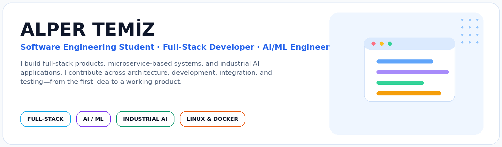
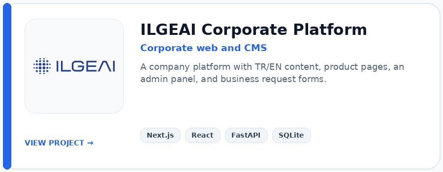
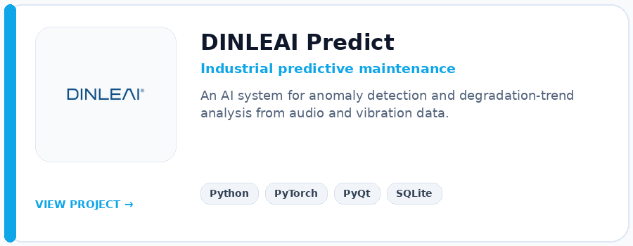
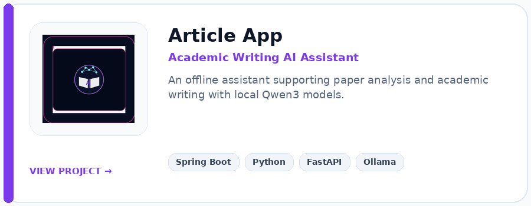
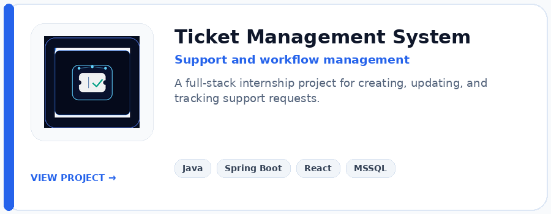
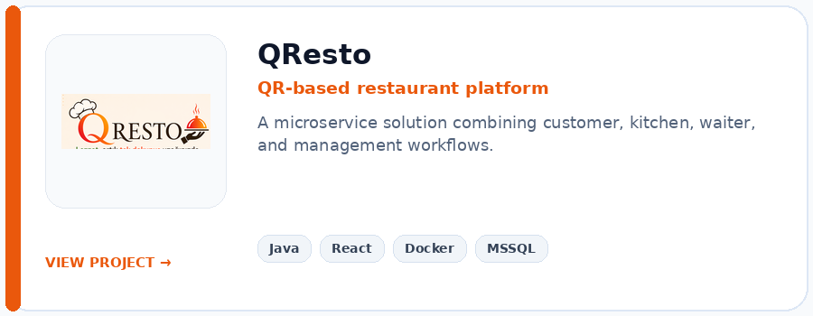
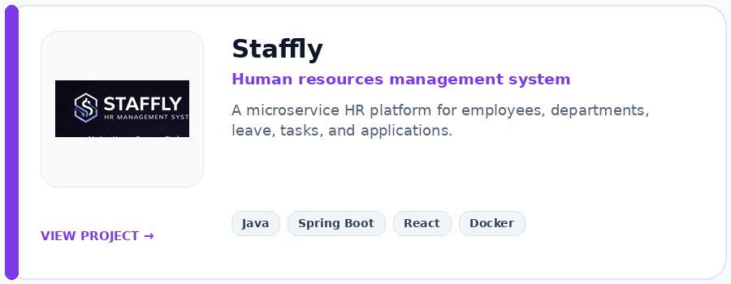
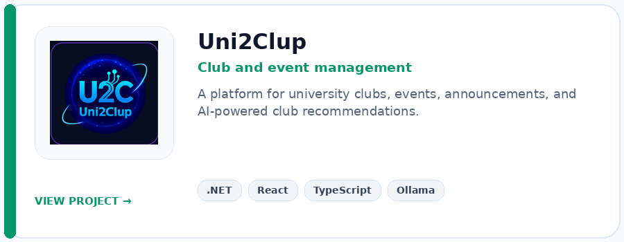
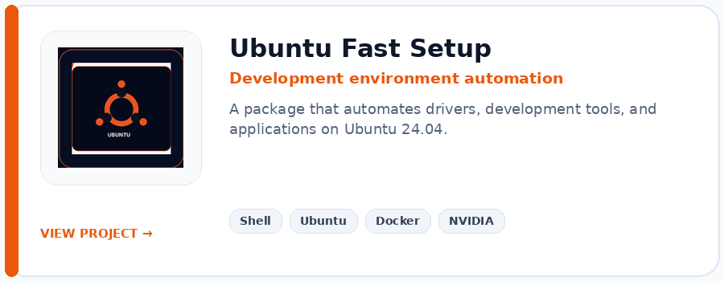
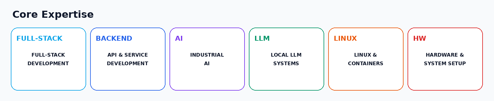

## 👤 About Me

<table>
<tr>
<td width="33%" align="center" valign="top">
  
<b>Doğuş University</b> 
Software Engineering 
2023 – 2027
</td>
<td width="33%" align="center" valign="top">
  
<b>ILGE Artificial Intelligence</b> 
Full-Stack Developer / AI Engineer Intern 
June 2026 – September 2026
</td>
<td width="33%" align="center" valign="top">
  
<b>Teknopark Istanbul</b> 
Full-Stack Developer Intern 
August 2025
</td>
</tr>
</table>

I work across full-stack product development, microservice architectures, backend/API development, industrial AI, local language models, and Linux-based development environments. In team projects, I take responsibility for architecture, Docker environments, security, Git/GitHub workflows, documentation, and coordination.

## 🚀 Featured Projects

<table>
<tr>
<td width="50%"></td>
<td width="50%"></td>
</tr>
<tr>
<td></td>
<td></td>
</tr>
<tr>
<td></td>
<td></td>
</tr>
<tr>
<td></td>
<td></td>
</tr>
</table>

### Article App — Academic Writing AI Assistant

I am developing an offline local AI assistant for Assoc. Prof. Dr. Burak Kızılöz to support academic paper analysis and writing workflows. The project uses a Spring Boot backend, a Python AI worker, Ollama, and Qwen3:8B / Qwen3:4B models. The repository is private because the project is actively being prepared for delivery.

## 🎯 Core Expertise

## 🧰 Technical Skills

**Programming:** `Java` · `Python` · `C#` · `JavaScript` · `TypeScript`  
**Frontend:** `React` · `Next.js` · `Tailwind CSS` · `HTML` · `CSS`  
**Backend:** `Spring Boot` · `FastAPI` · `.NET` · `REST API` · `Maven`  
**Databases:** `MSSQL` · `PostgreSQL` · `SQLite`  
**Tools and Platforms:** `Docker` · `Git/GitHub` · `PyTorch` · `Ollama` · `Ubuntu/Linux` · `Windows`

## 🖥️ Hardware and System Support

- Ubuntu and Windows installation, driver configuration, and development environment setup
- NVIDIA drivers, CUDA/PyTorch environments, and AI development workstation preparation
- Docker, Java, Python, Node.js, Maven, and database environment setup
- Workstation components, basic hardware installation, and system troubleshooting

## 🧩 Product Mindset

> ### I enjoy turning ideas into working software products.
> I consider not only the code, but also maintainability, user experience, integration, testing, documentation, and product goals when making technical decisions.

