

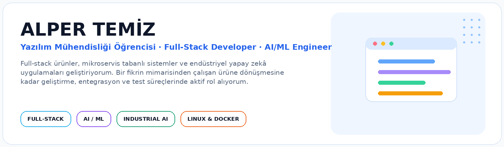

## 👤 Ben Kimim?

<table>
<tr>
<td width="33%" align="center" valign="top">
  
<b>Doğuş Üniversitesi</b> 
Yazılım Mühendisliği 
2023 – 2027
</td>
<td width="33%" align="center" valign="top">
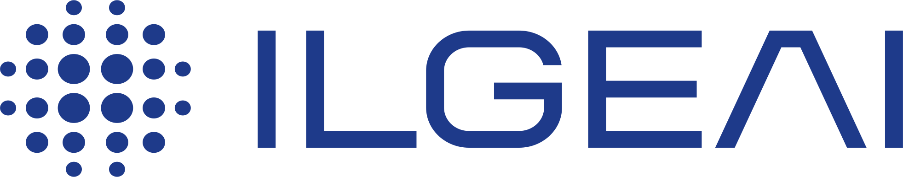  
<b>ILGE Yapay Zekâ</b> 
Full-Stack Developer / AI Engineer Intern 
Haziran 2026 – Eylül 2026
</td>
<td width="33%" align="center" valign="top">
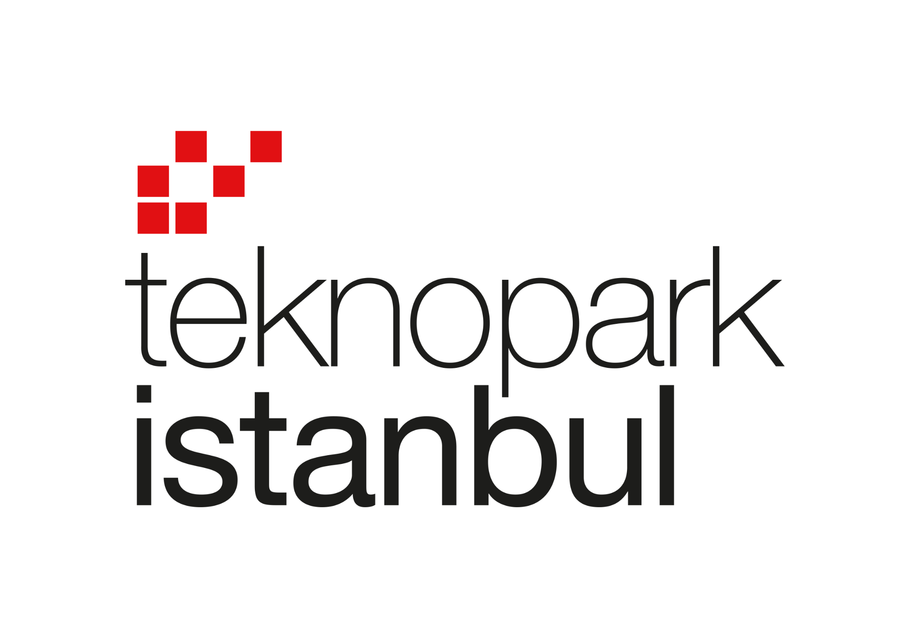  
<b>Teknopark İstanbul</b> 
Full-Stack Developer Intern 
Ağustos 2025
</td>
</tr>
</table>

Full-stack ürün geliştirme, mikroservis mimarileri, backend/API geliştirme, endüstriyel yapay zekâ, yerel dil modelleri ve Linux tabanlı geliştirme ortamlarında çalışıyorum. Takım projelerinde mimari kurgu, Docker ortamları, güvenlik, Git/GitHub süreçleri, dokümantasyon ve koordinasyon sorumlulukları üstleniyorum.

## 🚀 Öne Çıkan Projeler

<table>
<tr>
<td width="50%"><a href="https://ilgeai.com/">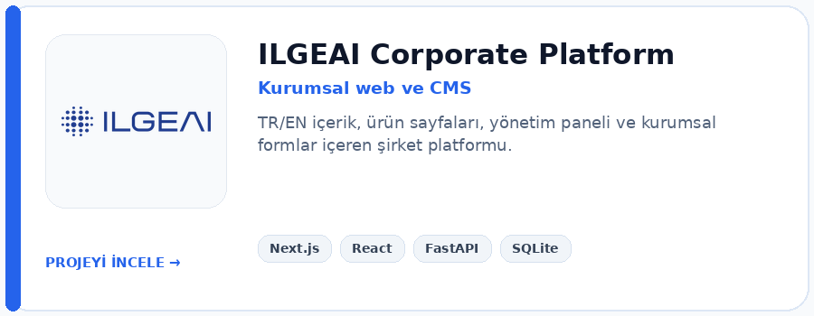</a></td>
<td width="50%"><a href="https://ilgeai.com/urunler/dinleai">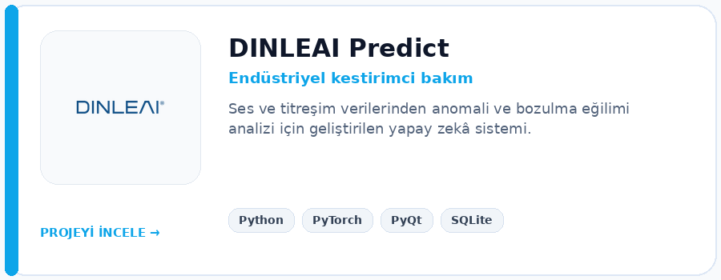</a></td>
</tr>
<tr>
<td><a href="#article-app--academic-writing-ai-assistant">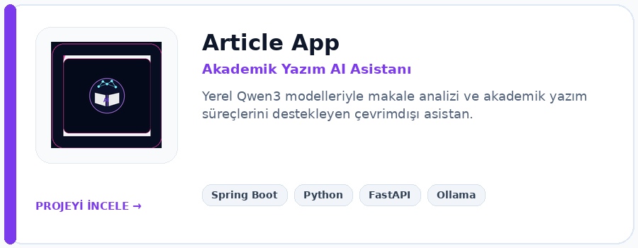</a></td>
<td><a href="https://github.com/alperrte/Ticket-Management-System">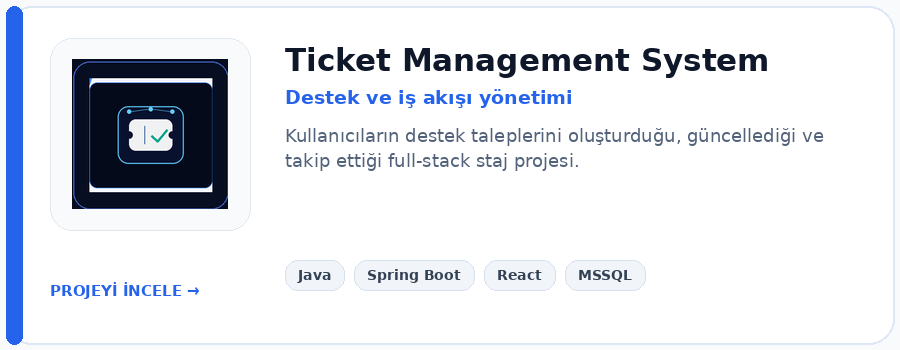</a></td>
</tr>
<tr>
<td><a href="https://github.com/alperrte/QResto">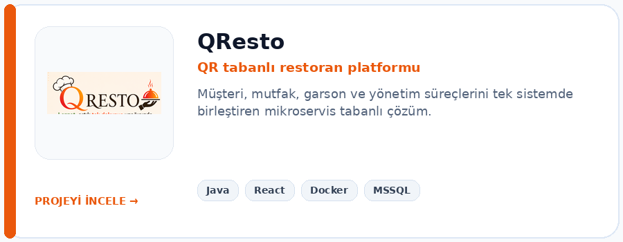</a></td>
<td><a href="https://github.com/alperrte/Staffly">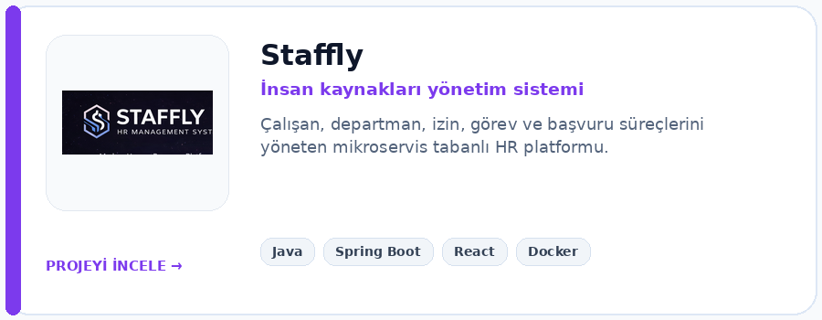</a></td>
</tr>
<tr>
<td><a href="https://github.com/alperrte/Uni2Clup-Project-">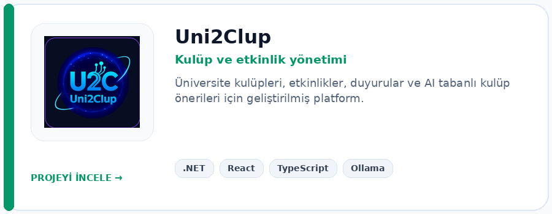</a></td>
<td><a href="https://github.com/alperrte/ubuntu-fast-setup">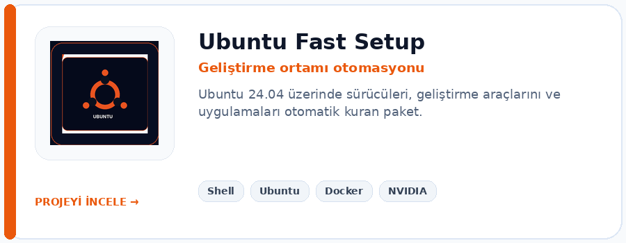</a></td>
</tr>
</table>

### Article App — Academic Writing AI Assistant

Doç. Dr. Burak Kızılöz için akademik makale analizini ve yazım süreçlerini kolaylaştıran, internet bağlantısı olmadan çalışan yerel bir yapay zekâ asistanı geliştiriyorum. Projede Spring Boot backend, Python AI worker, Ollama ve Qwen3:8B / Qwen3:4B modelleri kullanılıyor. Aktif teslim projesi olduğu için kaynak kod deposu gizlidir.

## 🎯 Uzmanlık Alanlarım

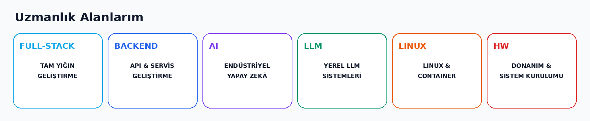

## 🧰 Teknik Yetkinlikler

**Programlama:** `Java` · `Python` · `C#` · `JavaScript` · `TypeScript`  
**Frontend:** `React` · `Next.js` · `Tailwind CSS` · `HTML` · `CSS`  
**Backend:** `Spring Boot` · `FastAPI` · `.NET` · `REST API` · `Maven`  
**Veritabanı:** `MSSQL` · `PostgreSQL` · `SQLite`  
**Araçlar ve Platformlar:** `Docker` · `Git/GitHub` · `PyTorch` · `Ollama` · `Ubuntu/Linux` · `Windows`

## 🖥️ Donanım ve Sistem Desteği

- Ubuntu ve Windows kurulumları, sürücü ve geliştirme ortamı yapılandırması
- NVIDIA sürücüleri, CUDA/PyTorch ortamı ve AI geliştirme sistemlerinin hazırlanması
- Docker, Java, Python, Node.js, Maven ve veritabanı ortamlarının kurulumu
- İş istasyonu bileşenleri, temel donanım kurulumu ve sistem sorunlarının analizi

## 🧩 Ürün Odaklı Yaklaşımım

> ### Yazılımı fikirden çalışan ürüne dönüştürmeyi seviyorum.
> Teknik kararların yalnızca kod tarafını değil; sürdürülebilirlik, kullanıcı deneyimi, entegrasyon, test, dokümantasyon ve ürün hedefleri üzerindeki etkisini de dikkate alıyorum.

