

&nbsp;

&nbsp;&nbsp;


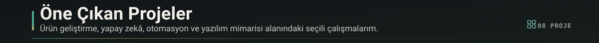

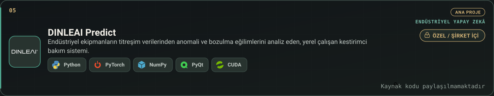

<a href="https://ilgeai.com">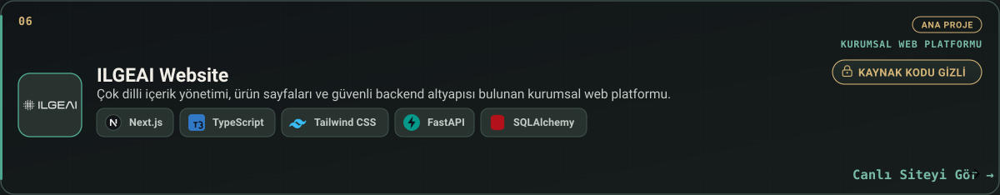</a>

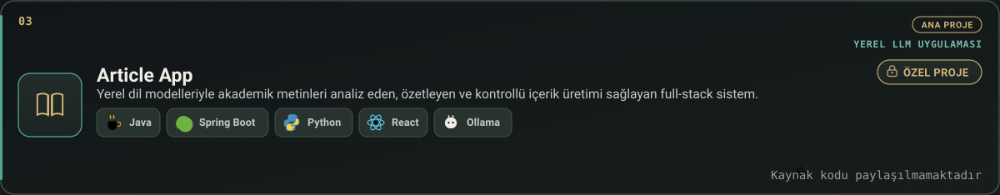

<a href="https://github.com/alperrte/QResto">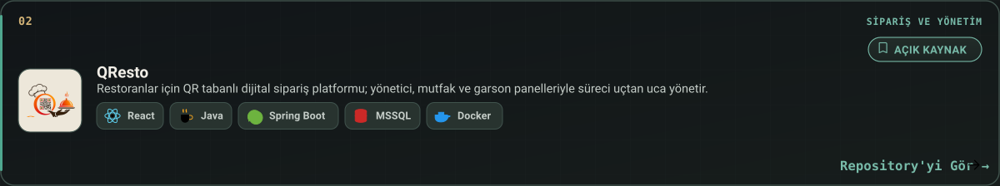</a>

<a href="https://github.com/alperrte/Staffly">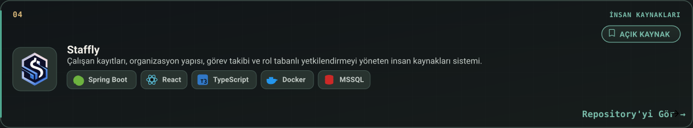</a>

<a href="https://github.com/alperrte/Uni2Clup-Project-">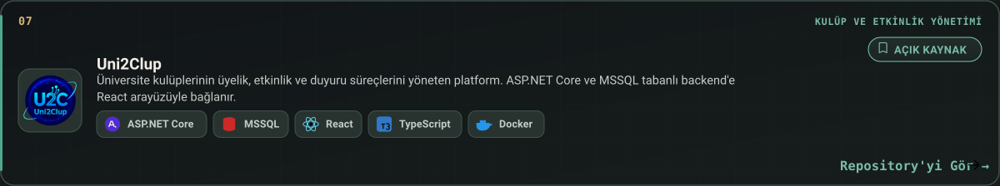</a>

<a href="https://github.com/alperrte/Ticket-Management-System">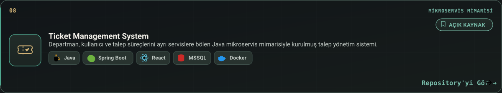</a>

<a href="https://github.com/alperrte/ubuntu-fast-setup">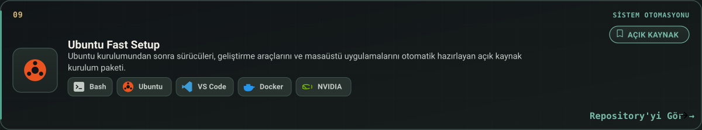</a>



&nbsp;&nbsp;

